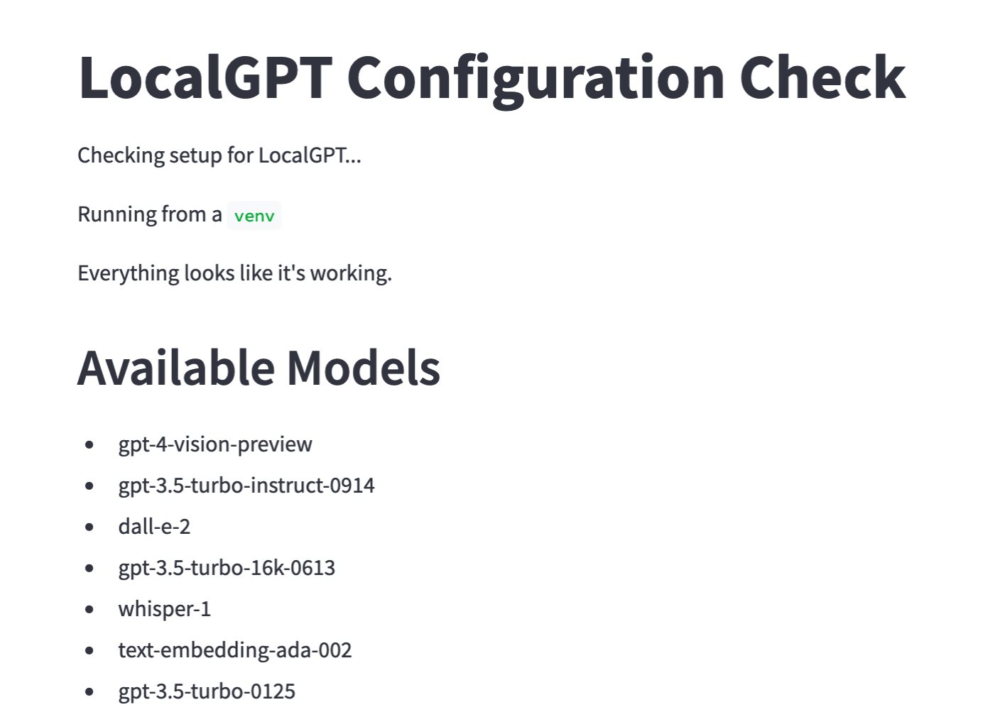

# Tooling

## Why not Cloud?

For this workshop we'll be running everything locally, and only reaching out to external service Application Programming Interfaces (APIs) when necessary.

This reduces external dependencies, makes for a more reliable demo, and teaches good habits for those looking to integrate these tools into their daily workflow.

## Local Setup

It's preferred to setup this tutorial locally as there are no additional charges or external service dependencies other than the OpenAI API.

1. Install [Git](https://www.git-scm.com/downloads) from <https://www.git-scm.com/downloads>
2. [Install Python 3](https://wiki.python.org/moin/BeginnersGuide/Download) from <https://wiki.python.org/moin/BeginnersGuide/Download>
3. Check that both are installed and accessible in your `$PATH`

   ```zsh
   git --version
   python3 --version
   ```

4. Clone the [zero-to-hero-ai repo](https://github.com/ai-village-demos/zero-to-hero-ai) from <https://github.com/ai-village-demos/zero-to-hero-ai>

   ```zsh
   cd <WHERE_YOU_WANT_WORKSHOP_EXAMPLES_DIR_TO_LIVE>
   git clone https://github.com/ai-village-demos/zero-to-hero-ai
   ```

5. Create a `venv`: [Creation of virtual environments](https://docs.python.org/3/library/venv.html)

   ```zsh
   cd zero-to-hero-ai
   python3 -m venv venv
   ```

6. Activate the `venv`

   ```zsh
   source ./venv/bin/activate
   ```

7. Install python requirements

   ```zsh
   pip3 install -r requirements.txt
   ```

8. Copy the `env.example` file to `.env` and open it

   ```zsh
   cp env.example .env
   ```

   Now open it in your favorite text editor.

9. Add API Key to the `.env` file

   ```toml
   # Insert your OpenAI API key
   OPENAI_API_KEY="<YOUR_API_KEY>"
   ```

10. Run the example app

   Switch to the `0-tooling` directory and run the `tooling-test.py` app

   ```zsh
   cd 0-tooling
   streamlit run tooling-test.py
   ```

   You should see the following screen:

   
