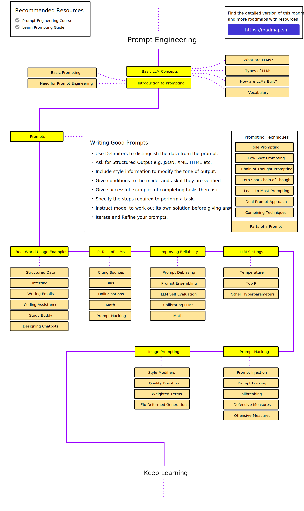
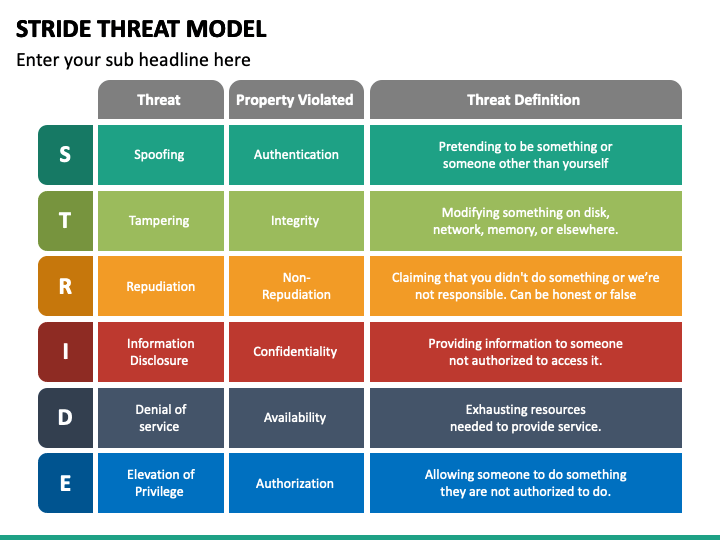

# Zero to Hero with ChatGPT API and Python

A 2 hour workshop given in the [AI Village](https://www.cactuscon.com/villages#block-yui_3_17_2_1_1704407426583_5547) at [CactusCon 12](https://www.cactuscon.com/cc12-schedule).

Time: **2:00 pm - 4:00 pm on Friday and Saturday** 
Presenters: **Elijah Woodward** and **Elio Grieco**

Looking for a way to break into the world of AI agents without getting overwhelmed? This hands-on session aims to teach you how to build your own AI agents from scratch using the OpenAI API and Python. The workshop emphasizes practical skills and is geared towards beginners to guide you in API usage, scripting, and web interfaces to help you boost your productivity.

Throughout the workshop, you'll build a local chatbot, craft a web application for analyzing exploit code, and develop a script that interacts with the Malware Bazaar API to gather intelligence and create informative presentations. By the end, you'll have hands-on experience in applying these skills to real-world scenarios and a solid understanding of OpenAI API and Python scripting. This workshop is an ideal starting point for industry beginners, especially Windows users, providing the foundational knowledge needed to embark on a journey in AI agent development with clarity and confidence.

## Workshop Overview

This is a basic overview of the exercises we'll cover in this workshop and what concepts will be explored during each:

0. Tooling
    - Installing Python
    - Adding dependencies
    - Alternate/Bonus: Installing [AIChat](https://github.com/sigoden/aichat): A Rust based app to use LLMs from the terminal.
1. Basic Prompts of LLMs
    - What is an LLM?
    - What is a prompt?
    - What is a good prompt?
2. Prompt Engineering
    - Refining prompts
    - Chain of thought reasoning
3. System Prompts
    - If you had an intern, what would you want them to do?
    - Creating a good system prompt
    - Using data formats e.g. markdown
4. Input and Output Guidance and Data Formats
    - Parsing sloppy input data
    - Output in specific formats like JSON, CSV
5. Code Generation
    - Cli chains
    - Explaining them
    - Writing Code in Python
6. Exploit Code Analysis and Detection Rule Generation
    - Creating SNORT rules for POC exploits on GitHub
7. Malware analysis via Malware Bazaar API
    - Finding vulnerabilities in files from GitHub repos
8. STRIDE Threat Modeling
    - What is STRIDE
9. Text Summarization
    - How to summarize text
    - Modifying the length of the summary

## Advice

The sheer amount and pace of research in this field is astounding. Keeping up with [even 10%](https://github.com/stas00/ml-engineering/blob/master/insights/ai-battlefield.md#dont-try-to-know-everything) of what is released every week is nearly impossible, even for those working in the field.

Given this pace, it's important to take a pragmatic, and goal focused approach to learning about AI. Decide what you would like to accomplish, and focus your research toward that goal.

## Exercises

### [0. Tooling](0-tooling/README.md)

In order to use any technology, there is usually common tooling that must be installed.

For this workshop we'll be using:

- Python
- OpenAI libraries
- Streamlit

Alternately, if you cannot get those to install there is [AIChat](https://github.com/sigoden/aichat), a simple Rust CLI app that can be installed by just dropping the executable into your path. It will ask for the `OPENAI_API_KEY` on the first run and automatically create a configuration file.

Some of the system prompt concepts that we will be covering later in the workshop can be emulated using [AIChat's roles](https://github.com/sigoden/aichat?tab=readme-ov-file#roles) feature. Refining and working with prompts can be accomplished via [sessions](https://github.com/sigoden/aichat?tab=readme-ov-file#session---context-aware-conversation).

### 1. Basic Prompts

LLMs (Large Language Models) at their core, are auto-complete systems. The patterns they use are far more complex than the old Markov Chain based auto-complete of just a few years ago.

#### Models

LLMs are odd compared to traditional computer programs. In a traditional program, the code completely governs what it does and how it works.

LLMs, like all machine learning based systems, are a combination of an algorithm/data structures and a training set of data that is used to teach the model what to do. Really this training data is the source of the model weights that allow the model to do useful things. It is a numerical encoding of the patterns that have been extracted from the training data.

Different [models](https://platform.openai.com/docs/models/overview) behave very differently depending on the size of the model, the training data provided to it, and the internal system prompt (which we'll cover later).

For this workshop we'll mostly be using [GPT-3.5 Turbo](https://platform.openai.com/docs/models/gpt-3-5-turbo) and [GPT-4](https://platform.openai.com/docs/models/gpt-4-and-gpt-4-turbo). As you build systems in the future, it's worth looking at other models to find those that best fit your needs and use cases e.g. **open-source and locally hosted models have far better privacy** and can potentially perform better (fine-tuning, lack of guard rails), and **are not at risk of becoming unavailable due to throttling, policy changes, or internet outages**.

#### Prompts

They are also unlike the search engines we've all grown used to over the past three decades. Search engines have mostly used keywords to find documents that match. While they have improved a bit, they are still pretty unsophisticated when it comes to queries, with fewer words (the essence of the query) tending to produce better results than fully formed questions.

With LLMs this is the exact opposite. They thrive on patterns, so the more text given, the more patterns there are to draw on when constructing answers.

### 2. Prompt Engineering

Going beyond the basics, there are specific techniques that we can use to improve the results we get back from an LLM.

We'll cover a few basic concepts such as:

- Zero-shot Prompting
- Few-shot Prompting
- Chain-of-Thought Prompting
- Self-Consistency

#### Roadmap

The actual space is much, much larger with multiple interrelated aspects as you can see in this map:

#### Resources

If you'd like to go deeper, take a look at these resources:

- [awesome-chatgpt-prompts](https://github.com/f/awesome-chatgpt-prompts): This repo includes ChatGPT prompt curation to use ChatGPT better.
- [Learn Prompting](https://learnprompting.org/docs/basics/prompt_engineering)
- [Prompt Engineering Guide](https://www.promptingguide.ai/)
- [awesome-gpt-prompt-engineering](https://github.com/snwfdhmp/awesome-gpt-prompt-engineering?tab=readme-ov-file): A curated list of awesome resources, tools, and other shiny things for GPT prompt engineering. (The roadmap above is taken from here.)

### 3. System Prompts

One idea that follows from the fact that we can use very long prompts to costomize how the LLM responds, is the idea of a `system prompt` that we can "prime" the model with to make it behave in a specific way with regard to more input.

Some good examples of system prompts:

- [ChatGPT-System-Prompts](https://github.com/mustvlad/ChatGPT-System-Prompts?tab=readme-ov-file#prompts-by-category)
- Daniel Miessler's [fabric](https://github.com/danielmiessler/fabric?tab=readme-ov-file#examples) project

### 4. Input and Output Guidance and Data Formats

In addition to the techniques above, the format of the data can be modified.

System prompts can be given in [Markdown](https://www.markdownguide.org/basic-syntax/) to help organize data for those constructing the prompt as well as the LLM acting on it. (The prompts in `fabric` above are good example of this.)

Additionally, output can be modified in several ways:

1. Ask for output in a specific format e.g. CSV or JSON
2. Provide a template to the LLM and ask it to format its answers according to the template.

### 5. Code Generation

LLMs can be used to generate code as well as written text and data. However there are a few caveats:

#### Caveats

- **Broken Code**: LLMs work based on patterns, but these patterns may not match those present in high quality, well engineered code. It's likely that generated code will not work or may give incorrect results if used directly. However, it is usually a good starting point that can be modified into robust, working code.
- **Mixed Library Versions**: Code may be generated that uses API calls from several versions of a given library. Most programming languages struggle to use multiple versions of the same library in a single program. If it compiles/works at all, you'll probably have to modify the code to use the newest API before running the code.
- **Subtle Bugs**: Because the LLM does not understand the dataflow through the program, nor any of the program logic directly, it may have bugs that are not immediately apparent. The generated code is also unlikely to properly account for all possible values/patterns in input data, or various exceptional conditions that may occur during use.
- **The Code Paradox**: LLMs are better at generating "boilerplate" style code than novel new algorithms. However, boilerplate code is the sign of a poorly designed system and can decrease software quality, increase code churn, and make code harder to maintain. Basically, they are good at bad code.

- [New GitHub Copilot Research Finds 'Downward Pressure on Code Quality' -- Visual Studio Magazine](https://visualstudiomagazine.com/articles/2024/01/25/copilot-research.aspx)
- [Coding on Copilot: 2023 Data Suggests Downward Pressure on Code Quality (incl 2024 projections) - GitClear](https://www.gitclear.com/coding_on_copilot_data_shows_ais_downward_pressure_on_code_quality)

### 6. Exploit Code Analysis and Detection Rule Generation

- [Exploit Database - Exploits for Penetration Testers, Researchers, and Ethical Hackers](https://www.exploit-db.com/)

### 7. Malware analysis via Malware Bazaar API

### 8. STRIDE Threat Modeling

### 9. Text Summarization
